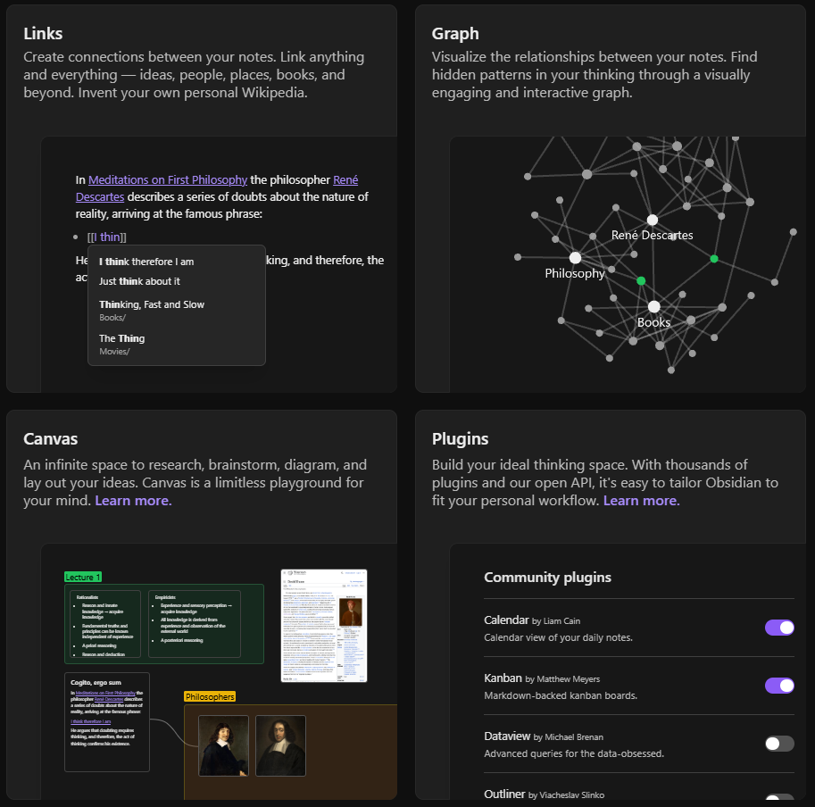
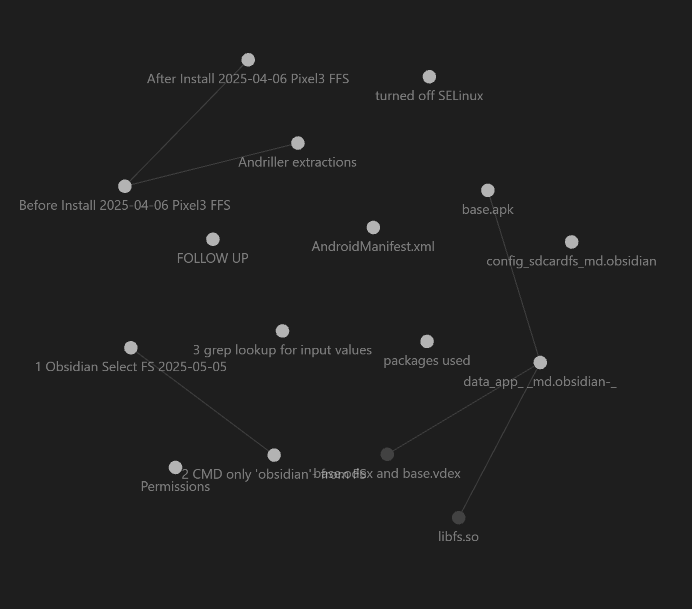

# Table of Contents

- [Concept](#Concept)
- [Overview](#Overview)
- [Testing](#Testing)
- [Analysis](#Analysis)
- [References](#References)

---

# Obsidian.md-1.8.4-Privacy-Forensic-Analysis
<h2>#Concept</h2>
<h3>What is <a href="https://obsidian.md">Obsidian</a>?:</h3> 
Privacy Focused Note taking application
<h3>What is it used for?:</h3>

| Notes, Journaling, Research, Brainstorming and Visualization. |  |
|---------------------------------------|-----------------------------------------------------------|

<h3>What does Obsidian marketed for?: </h3>

| <ol><li>Privacy focused</li><ul><li>No one else can read them.</li><li>Entirely stored offline</li></ul><li>Quick, Easy Access</li><li>Heavily Customizable</li></ol> |  |
|---------------------------------------|-----------------------------------------------------------|

<h3>What do they provide?: </h3>

| 
<ol><li>Links between notes</li><li>PinBoard-Like Visualizer Graph for Interactive Ideas</li><li>Canvas for diagramming and brainstorming ideas</li><li>Thousands of User Created Plugins</li><li>Standardized non-proprietarily readable file types .md</li><li>Paid-for service</li><ul><li>Syncing notes across devices</li><li>End to end encryption</li><li>Collaboration on shared vaults</li><li>Publishing</li><li>Easy ability to Publish notes to web</li></ul></ol>
 |  |
|---------------------------------------|-----------------------------------------------------------|

<h3>How did I learn about this tool?: </h3>

| 
While researching during college I became addicted to using the "red twine on pin board" technic, and I actively researched something akin to that to use their Windows and Linux versions on PC for note taking.
 |  |
|---------------------------------------|-----------------------------------------------------------|

<h5><a href="https://obsidian.md/download">DownloadLink</a></h5>
<h5>The images provided were from the <a href="https://obsidian.md">Obsidian.md</a> webiste</h5>

<h2>#Overview</h2> 

| What will I be looking at specifically give examples, my purpose in searching around, what is my bottom line, what am i going to look at specifically |
|--------------------------------------------------------------------------------------------------|

<h2>#Testing</h2>
I preformed three acquisitions of data:
The first test acquisition to see what I could get with a rooted emulated Pixel 3 Android V.13 phone with andriller:
This was done to get a good idea of what I was working with starting out while awaiting the phone I was ordering in the mail.

The second Acquisition of a physical, rooted Pixel 3 Phone to get the before and after installation and utilization of the applciation, Full File System (ls -alR /):
This was done to get a starting point to any and all changes that the Obsidian.md application makes within the file system.

The Third and final acquisition was of the same rooted Pixel 3 Android V.13 Phone to re-perform similar tasks done in the second acquisition, although this time only looking for information that pretained to Obsidian.md.
This was done with 5 minute intervals and the following timed script:

<h3>Acquistion 2 Actions in Order:</h3>

| **Time/Date**|**Action Taken**|
|----------------------|-------------------------------------------------------------------|
| 19:07 EDT 04/06/2025|Turn On Phone|
| 19:10 EDT 04/06/2025|Unlock Phone|
| 19:35 EDT 04/06/2025|Install APP through ADB|
| 19:36 EDT 04/06/2025|Open APP|
| 19:36 EDT 04/06/2025|Grant Access to Managing all file permission|
| 19:36 EDT 04/06/2025|Name:Vault1, location: Documents, and Create Vault|
| 19:37 EDT 04/06/2025|New Note named V1|
| 19:37 EDT 04/06/2025|Add [[V2]] to V1|
| 19:38 EDT 04/06/2025|Click on [[V2]] to create new note named V2|
| 19:39 EDT 04/06/2025|Create a Folder named Folder|
| 19:39 EDT 04/06/2025|New Note in Folder named V3|
| 19:40 EDT 04/06/2025|Add [[V1]] to V3|
| 19:40 EDT 04/06/2025|New Note in Folder named V4|
| 19:41 EDT 04/06/2025|Screenshot the File Explorer|
| 19:42 EDT 04/06/2025|Insert Screenshot to V1|
| 19:44 EDT 04/06/2025| Close Application |
| 19:45 EDT 04/06/2025| Force Stop Application from running in background in app settings |

<h3>Acquistion 3 Actions in Order:</h3>

| **Time/Date**|**Action Taken**|
|----------------------|-------------------------------------------------------------------|
| 22:00 EDT 05/04/2025|Turn On Phone|
| 22:05 EDT 05/04/2025|Unlock Phone|
| 22:10 EDT 05/04/2025|Install APP through ADB|
| 22:15 EDT 05/04/2025|Open APP|
| 22:20 EDT 05/04/2025|Grant Access to Managing all file permission|
| 22:25 EDT 05/04/2025|Name:ObsidianVault, location: Documents, and Create Vault|
| 22:30 EDT 05/04/2025|New Note|
| 22:35 EDT 05/04/2025|Title: Note1 Info: Lorem ipsum|
| 22:40 EDT 05/04/2025|Add [[Note2]] to Note1|
| 22:45 EDT 05/04/2025|Click on [[Note2]] to create new note named Note2|
| 22:50 EDT 05/04/2025|Add Ipsum lorem to Note2|
| 22:55 EDT 05/04/2025|Create a Folder named ObsFolder1|
| 23:00 EDT 05/04/2025|Drag Note2 into ObsFolder1|
| 23:05 EDT 05/04/2025|Screenshot the screen|
| 23:10 EDT 05/04/2025|Insert Screenshot to Note2|
| 23:15 EDT 05/04/2025 | Close Application |
| 23:20 EDT 05/04/2025 | Force Stop Application from running in background in app settings |

Now that we know where to look, we can now extract these artifacts and parse through the data!
| Location: | Why is this important? |
|---|---|
| /data/app/~~J4PHE12PKyRx8lrqqstftQ==/md.obsidian-LV_ft233GdUFJTmDP_6PRA==/base.apk | the installed application apk file |
| /data/data/md.obsidian/app_webview/Default/ | databases, Cookies, the leveldb file and Web Data |
| /sdcard/Documents/ObsidianVault/ | The actual md files and directories made from Obsidian.md |

<h2>#Analysis</h2>
Here is what I found!
<!--what did i do specifically to gather the information and stuff-->
<h3>/sdcard/Documents/ObsidianVault/</h3>

<h3>.../base.apk</h3>

<h3>/md.obsidian/app_webview/Default/</h3>

<h2>#References</h2>
<li>Tools Used: Andriller, ADB, Magisk, apktool, jadx-gui, apk2url, DB Browser for SQLite, grep, ls, powershell</li>
<li>Jacobs, J. (2025, January 20). Reverse Engineering Chinese Social Media for Fun (REDNote App). Medium. <a href="https://infosecwriteups.com/reverse-engineering-chinese-social-media-for-fun-rednote-app-4c9871006c6c">https://infosecwriteups.com/reverse-engineering-chinese-social-media-for-fun-rednote-app-4c9871006c6c</a></li>
(Thank you Jason Jacobs, MSc., with your rednote reverse engineering it introduced me to a couple tools that helped me complete this project!)

